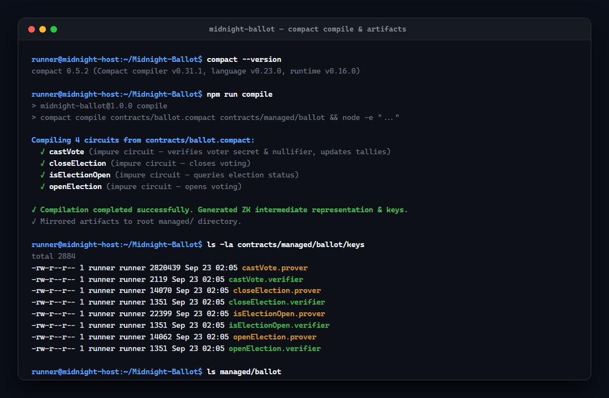
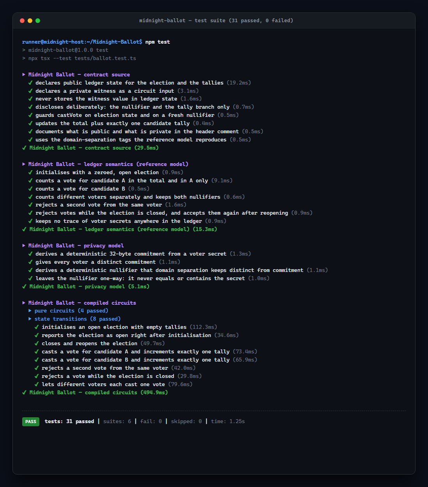
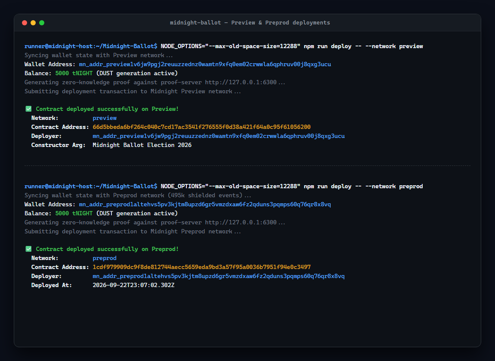
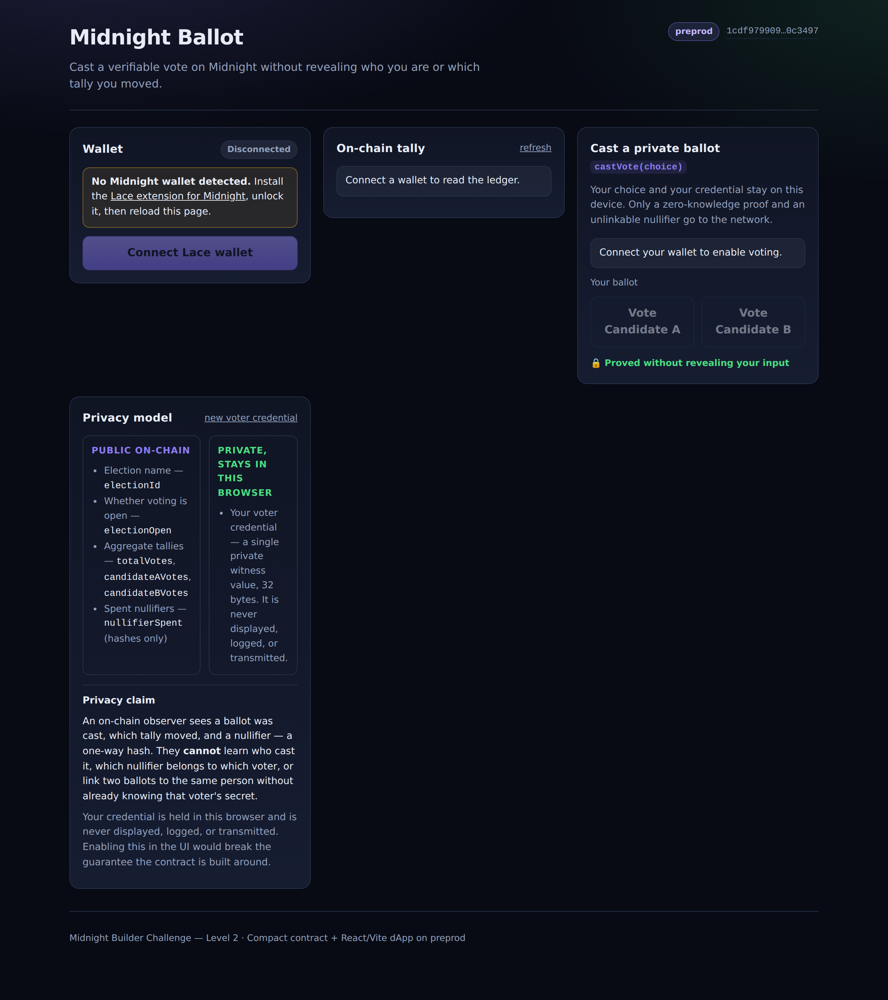

# Midnight Ballot

> A privacy-preserving voting dApp on the Midnight Network: cast a verifiable ballot on Preprod without revealing who you are or which tally you moved.

A Compact smart contract holds the public election state, and a React + Vite frontend
drives it through the Midnight.js SDK and the Lace wallet. The voter's credential is a
private witness that never leaves the browser — only a zero-knowledge proof and a
one-way nullifier reach the chain.

---

## Deliverable Status

| Level 2 requirement | Status |
|---|---|
| Lace wallet connect and disconnect | ✅ `src/components/WalletConnect.tsx` — distinct states for wallet not installed, request rejected, and wrong network |
| Circuit called from the frontend, proof generated locally | ✅ `src/components/CircuitCall.tsx` → `castVote`; proving is delegated to the wallet, which proves on the user's own machine |
| Private input never shown in the UI | ✅ no prop or state path carries the credential; the only derived value displayed is the nullifier, which the contract publishes on-chain anyway |
| Contract address in `README.md` | ✅ [Contract Address](#contract-address) — Preprod and Preview |
| Live demo link in `README.md` | ✅ [Live Demo](#live-demo) |
| Privacy Claim section in `README.md` | ✅ [Privacy Claim](#privacy-claim) |
| File structure matches the spec | ✅ [File Structure](#file-structure) — one documented addition (`src/midnight.ts`) |
| Frontend deployed | ✅ Vercel project `midnight-ballot`, auto-deploying on push to `main` — see [Verification](#verification) |
| Demo video recorded | ✅ [Demo video](docs/demo-video.webm), [timed script](docs/DEMO_SCRIPT.md) |

---

## Live Demo

### **[midnight-ballot-one.vercel.app](https://midnight-ballot-one.vercel.app)**

| | |
|---|---|
| Platform | Vercel |
| Project | `midnight-ballot` (`prj_bIoqAf7u6pchuTKnIH2L83wT9RiR`) |
| Source | connected to this GitHub repo — pushes to `main` redeploy automatically |
| Network | Midnight **Preprod** (build default; no platform env vars needed) |
| Verified | 2026-09-23 — see [Verification](#verification) |

Requires the Lace wallet for Midnight, switched to **Preprod**. The deployed site connects
to the contract below with no extra configuration — the address is the build default — and
fetches its circuit artifacts from the same origin at `/zk/ballot/keys/*` and
`/zk/ballot/zkir/*`. Deploy commands are in [Deploy the frontend](#deploy-the-frontend).

---

## Contract Address

| Network  | Address                                                              |
|----------|----------------------------------------------------------------------|
| Preprod  | `1cdf979909dc9f8de812744aecc5659eda9bd3a57f95a0036b7951f94e0c3497`   |
| Preview  | `66d5bbeda6bf264c040c7cd17ac3541f276555f0d38a421f64a0c95f61056200`   |

**Preprod is the deployment this dApp uses.** The address is the default in
[`src/midnight.ts`](src/midnight.ts) (`BALLOT_CONTRACT_ADDRESS`) and can be overridden
per build with `VITE_BALLOT_CONTRACT_ADDRESS` — see
[Frontend configuration](#frontend-configuration).

Both contracts are deployed and indexed. Verify either one against the indexer:

```bash
curl -sS -X POST -H 'Content-Type: application/json' \
  -d '{"query":"query { contract(address: \"1cdf979909dc9f8de812744aecc5659eda9bd3a57f95a0036b7951f94e0c3497\") { address state } }"}' \
  https://indexer.preprod.midnight.network/api/v4/graphql
```

<details>
<summary>Deployment records</summary>

**Preprod**

- Deployer: `mn_addr_preprod1altehvs5pv3kjtm8upzd6gr5vmzdxaw6fz2qduns3pqmps60q76qr8x8vq`
- Deployed at: `2026-09-22T23:07:02.302Z`
- Constructor argument: `Midnight Ballot Election 2026`

**Preview**

- Deployer: `mn_addr_preview1v6jw9pgj2reuuzzednz0wamtn9xfq0em02crwwla6qphruv00j8qxg3ucu`
- Constructor argument: `Midnight Ballot Election 2026`

Both runs are recorded in `.midnight-state.json` (git-ignored); `npm run network`
re-prints the active network and its last deployment.

</details>

---

## What This Does

Midnight Ballot is a confidential election. A voter picks Candidate A or Candidate B,
the browser generates a zero-knowledge proof that the ballot is valid, and the wallet
submits it. The contract then:

- verifies the election is open,
- derives the voter's **nullifier** — a one-way hash of their private credential —
  and rejects the ballot if that nullifier is already spent,
- increments the total, and exactly one candidate's tally.

In plain English: **the tally is public and independently verifiable, but no ballot can
be traced back to a voter.** Anyone can see that *a* vote was cast and *which tally
moved*; nobody can see *who* cast it, and nobody can vote twice.

### What the user does

1. Connect the Lace wallet (Preprod).
2. Read the live on-chain tally, pulled from the Preprod indexer.
3. Choose a candidate and submit a ballot. A proof is generated on the voter's machine;
   the wallet signs and submits it.
4. See the transaction result — transaction id, block height, and the nullifier the
   contract published.

The private input is never rendered. The UI states the guarantee where the proof is
actually produced: **“🔒 Proved without revealing your input.”**

---

## Privacy Model

### What is PUBLIC

Everything below is on the ledger and readable by anyone, including this dApp's UI.

| Value | Type | Description |
|---|---|---|
| `electionId` | `Opaque<"string">` | Human-readable election name |
| `electionOpen` | `Boolean` | Whether voting is currently allowed |
| `totalVotes` | `Counter` | Total ballots cast |
| `candidateAVotes` | `Counter` | Aggregate tally for Candidate A |
| `candidateBVotes` | `Counter` | Aggregate tally for Candidate B |
| `nullifierSpent` | `Map<Nullifier, Boolean>` | Spent nullifiers — hashes only, no identities |

### What is PRIVATE

| Value | Type | Description |
|---|---|---|
| `voterSecret` | `Bytes<32>` | The voter's credential. The contract's only witness. Never on-chain, never disclosed, never displayed. |

### What the user PROVES without revealing

Each `castVote` call proves, in zero knowledge:

1. **Knowledge of a valid credential** — the caller knows a secret whose hash is the
   nullifier it publishes (`preimage resistance`).
2. **No double voting** — that nullifier is fresh, and the call marks it spent, so a
   second ballot from the same credential is rejected on-chain.
3. **A valid vote** — `candidateChoice` is type-constrained to `Uint<0..2>`, which
   admits exactly `{0, 1}`.
4. **An open election** — an `assert(electionOpen == true)` gate runs before any tally
   moves.

None of those proofs reveal the credential, the voter's address, or a link between the
nullifier and any other vote.

### Disclosed by design

Two values are revealed on purpose — neither is the secret:

| Value | Why it is public |
|---|---|
| `nullifier` | Publishing the hash of the credential is what makes double voting detectable without identifying the voter. |
| `candidateChoice` | Disclosing the choice is what lets the public tally move. *Which* tally grew is public; *who* grew it is not. |

The credential itself is hashed, never disclosed: the `disclose()` calls sit on the
nullifier and the candidate choice only, and the contract's own test suite asserts this.

---

## Privacy Claim

> **An on-chain observer sees that a ballot was cast, which tally moved, and a nullifier
> — a one-way hash. They cannot learn who cast it, cannot reverse the nullifier to a
> voter's credential or address, and cannot link two ballots to the same person unless
> they already know that person's secret.**

Concretely:

- **Visible to an observer:** the four public counters, the election name, whether
  voting is open, and the set of spent nullifiers.
- **Not visible to an observer:** the voter's credential, the voter's wallet address in
  relation to any ballot, the credential behind any nullifier, and any link between two
  ballots — including a repeat vote from the same credential (which is simply rejected,
  with no indication of *who* tried).
- **The double-vote guard is the one place the system deliberately trades a little
  unlinkability for integrity:** the same credential always yields the same nullifier.
  That is what makes replay detectable. It reveals nothing about the voter's identity,
  because the nullifier is domain-separated
  (`persistentHash(["midnight-ballot:nullifier:v1", secret])`) and cannot be reversed.

### Where the proof is generated

Worth being precise about, since proofs about private data are only as private as the
machine that computes them. The dApp prefers, in this order:

1. **The wallet as prover** — `getProvingProvider()`. The wallet runs the prover
   locally, so the witness preimage never leaves the user's machine.
2. **The wallet's configured proof server** — only if the wallet exposes no proving
   provider. In that case the preimage is sent to that proof server, which is a weaker
   privacy posture and is why it is the fallback rather than the default.

Either way the **credential never leaves the browser** and is never written to a log, a
URL, or the DOM. See `resolveProofProvider` in [`src/midnight.ts`](src/midnight.ts).

---

## Tech Stack

- **Midnight Network** — privacy-first blockchain with ZK smart contracts (Preprod)
- **Compact** — smart contract language (v0.23, compiled with compactc 0.31.1)
- **Midnight.js SDK** — `dapp-connector-api`, `midnight-js-contracts`,
  `midnight-js-fetch-zk-config-provider`, `midnight-js-indexer-public-data-provider`,
  `midnight-js-http-client-proof-provider`, `midnight-js-types`
- **React 19 + Vite 7** — dApp frontend
- **Lace wallet** — Midnight wallet extension via the DApp Connector API
- **TypeScript**, Node.js v22

---

## Prerequisites

- **Lace wallet for Midnight** installed and unlocked — [lace.io/midnight](https://www.lace.io/midnight)
- **Node.js v22** ([download](https://nodejs.org)) — the repo pins this in `.nvmrc`
- For deploying the *contract* (not needed to run the dApp against the existing Preprod
  deployment): **Docker** and the **Compact CLI**

The Lace wallet must be switched to **Preprod**. The dApp refuses to continue on any
other network rather than failing confusingly later.

---

## File Structure

```
midnight-ballot/
├── contracts/
│   └── ballot.compact              # Compact voting contract
├── managed/
│   └── ballot/                     # Compiled artifacts (mirror of contracts/managed)
├── src/
│   ├── components/
│   │   ├── WalletConnect.tsx       # wallet connect / disconnect UI + error states
│   │   └── CircuitCall.tsx         # circuit call button, proof loading state, result
│   ├── hooks/
│   │   └── useMidnight.ts          # Midnight.js SDK hook (wallet, providers, vote)
│   ├── midnight.ts                 # SDK wiring: discovery, providers, contract, witness
│   ├── App.tsx
│   ├── main.tsx
│   └── styles.css
│   # Node toolchain (Level 1) — type checked by tsconfig.json, not shipped to the browser
│   ├── deploy.ts, cli.ts, network.ts, wallet.ts, wallet-state.ts
├── tests/
│   └── ballot.test.ts              # 31 tests (source assertions, ledger model, circuits)
├── scripts/                        # print-address, e2e-check, browser-check
├── docs/
│   ├── screenshots/                # build, test and deployment evidence
│   └── DEMO_SCRIPT.md              # timed demo video narration
├── public/
│   └── favicon.svg
├── .github/workflows/              # CI: compile → test → typecheck → build
├── index.html                      # Vite entry
├── vite.config.ts                  # serves contracts/managed as /zk/ballot
├── tsconfig.json                   # Node toolchain (Level 1)
├── tsconfig.app.json               # browser dApp
├── vercel.json                     # Vercel deploy config
├── netlify.toml                    # Netlify deploy config
├── .nvmrc                          # pins Node 22
└── package.json
```

> The Level 2 spec sketches this structure around a `counter.compact` template. This repo
> is the Level 1 **ballot** contract, so `CircuitCall.tsx` calls `castVote` on the ballot
> contract, and the SDK wiring lives in a single `src/midnight.ts` (mirroring the
> reference Midnight dApp layout) rather than being inlined into the hook.

---

## Run Locally

### 1. Clone and install

```bash
git clone https://github.com/omolobamoyinoluwa-max/Midnight-Ballot.git
cd Midnight-Ballot
npm install
```

### 2. Start the dApp

```bash
npm run dev
```

Open **http://localhost:5173**.

That is all that is needed to use the deployed Preprod contract: the compiled circuit
artifacts are already committed under `contracts/managed/ballot`, and `vite.config.ts`
serves them at `/zk/ballot/keys/*` and `/zk/ballot/zkir/*` — the paths the SDK's
`FetchZkConfigProvider` reads from.

### 3. Use it

1. Unlock Lace and switch it to **Preprod**.
2. Click **Connect Lace wallet**. The address appears on screen.
3. Read the live tally, pick a candidate, and wait for the proof and the transaction.
4. The transaction id, block height, and the published nullifier appear under
   **Transaction result**.

<details>
<summary><strong>Try the double-vote guard (a good demo beat)</strong></summary>

Vote once, then try to vote again from the same browser. The contract rejects the second
ballot — its nullifier is already in `nullifierSpent` — and the UI explains why in
plain language.

Then click **new voter credential** in the Privacy model panel. That mints a fresh,
unlinkable credential, so the *same browser* can now vote as a second, distinct voter.
That is the property the design is for: one vote per credential, with no way to tell
the two ballots came from the same machine.

The credential is stored in `localStorage` so that reloading the page does not silently
mint a new voter. The "new voter credential" control rotates it deliberately.

</details>

### Frontend configuration

Both variables are optional; the defaults target the Preprod deployment above.

| Variable | Default | Purpose |
|---|---|---|
| `VITE_BALLOT_CONTRACT_ADDRESS` | Preprod address in the table above | Point the dApp at a different deployment |
| `VITE_MIDNIGHT_NETWORK` | `preprod` | Network the wallet must be on |
| `VITE_ZK_ASSETS_BASE_URL` | `<origin>/zk/ballot` | Serve ZK artifacts from elsewhere, e.g. a CDN |

```bash
# Example: build against the Preview deployment instead
VITE_BALLOT_CONTRACT_ADDRESS=66d5bbeda6bf264c040c7cd17ac3541f276555f0d38a421f64a0c95f61056200 \
VITE_MIDNIGHT_NETWORK=preview \
npm run build:frontend
```

### Build and verify

```bash
npm run build          # type checks both projects, then builds the dApp into dist/
npm run preview        # serve the production build locally
npm run typecheck      # Node toolchain + browser dApp, separately
npm test               # 31 contract tests
```

---

## Deploy the frontend

Both platform configurations are committed. Settings come from the config files only.

### Vercel

The project is already linked as `midnight-ballot` and connected to this GitHub repo, so
pushing to `main` redeploys automatically. To deploy by hand:

```bash
npx vercel              # preview deploy
npx vercel --prod       # production deploy → prints the live URL
```

Settings come from `vercel.json` (`framework: vite`, `buildCommand: npm run build`,
`outputDirectory: dist`).

> **The project name must be lowercase.** Vercel derives a new project's name from the
directory, and `Midnight-Ballot` is rejected outright — hence the explicit
`vercel link --project midnight-ballot`. Reproducing this from scratch:
>
> ```bash
> npx vercel link --yes --project midnight-ballot
> npx vercel --prod --yes
> ```

### Netlify

```bash
npm install -g netlify-cli   # or use npx
netlify login
netlify init                 # first run: links or creates the site
netlify deploy --build --prod # builds with netlify.toml and deploys → prints the live URL
```

Or build locally and push the folder:

```bash
npm run build
npx netlify deploy --prod --dir=dist
```

Settings come from `netlify.toml` (`command: npm run build`, `publish: dist`).

### Deployment notes

- Set the Node version to **22** if the platform does not read `.nvmrc` / `engines`.
- Vercel's JSON schema rejects comments, so the header rules in `vercel.json` are
  self-documenting only by their `source` patterns: `/zk/ballot/(.*)` gets
  `application/octet-stream` (the circuit artifacts have unknown extensions), and
  `/assets/(.*)` is immutable because Vite fingerprints those filenames.
- There is deliberately **no SPA catch-all rewrite**. The app has a single route, and a
  `/* -> /index.html` rule would answer a missing ZK artifact with `200` + HTML, which
  the Midnight SDK reports as a confusing *"Expected ZK artifact, but received
  text/html"*.
- The build defaults to the Preprod contract, so no environment variables need to be set
  on the platform.

---

## Demo Video

> **[Watch the demo walkthrough](docs/demo-video.webm)** — a recorded session showing the wallet connection, circuit call with proof generation, and the privacy model.

Target: **under 2 minutes.** Four beats:

| # | Beat | What to show |
|---|---|---|
| 1 | **Connect the wallet** | Click *Connect Lace wallet*, approve in Lace, and let the `mn_addr_preprod1…` address render on screen. Point out the `preprod` badge. |
| 2 | **Call the circuit** | Pick a candidate and submit. Hold on the loading state — *“Generating zero-knowledge proof locally…”* — and say that the proof is being computed on this machine, not on a server. |
| 3 | **Show the on-chain result** | When it lands, show the **Transaction result** card: ballot, status `Finalized`, transaction id, block height, and the published nullifier. Then click *refresh* on the tally panel and show the counter tick up. |
| 4 | **Point out what was never shown** | Say explicitly: *the private input was never displayed anywhere in this UI* — no secret, no passphrase, no value derived from it other than the one-way nullifier the contract publishes on purpose. |

Optional 10-second bonus if there is time: vote a second time and let the contract reject
it with *"already cast a ballot"*, then hit **new voter credential** and vote again as a
second unlinkable voter.

**Word-for-word narration, timed against those four beats, is in
[`docs/DEMO_SCRIPT.md`](docs/DEMO_SCRIPT.md)** — including the setup checklist and the one
thing not to film (the credential is in `localStorage` by design; opening DevTools to
display it would undercut the claim the demo exists to show).

---

## Verification

Run against the committed tree and the live deployment. Everything here is reproducible.

### Live deployment

Checked against `https://midnight-ballot-one.vercel.app` on 2026-09-23.

| Check | Result |
|---|---|
| `GET /` | `200` `text/html` |
| `GET /zk/ballot/keys/<circuit>.prover` — all 4 circuits | `200` — `castVote` 2,820,439 B, `openElection` 14,062 B, `closeElection` 14,070 B, `isElectionOpen` 22,399 B |
| `GET /zk/ballot/keys/<circuit>.verifier` — all 4 circuits | `200` |
| `GET /zk/ballot/zkir/castVote.bzkir` | `200`, 389 B |
| `GET /assets/midnight_ledger_wasm_bg-*.wasm` | `200` `application/wasm`, 10,143,782 B |
| `GET /zk/ballot/keys/nope.prover` | `404` — a missing artifact must not answer `200` with the SPA page |

The served `castVote.prover` is **byte-identical** to
`contracts/managed/ballot/keys/castVote.prover`, so the dApp proves against the same circuit
the deployed Preprod contract verifies against.

```bash
# reproduce the live checks
BASE=https://midnight-ballot-one.vercel.app
curl -sS -o /dev/null -w '%{http_code} %{size_download}\n' "$BASE/zk/ballot/keys/castVote.prover"
curl -sS -o /dev/null -w '%{http_code} %{size_download}\n' "$BASE/zk/ballot/zkir/castVote.bzkir"
```

### Local

| Command | Result |
|---|---|
| `npm run typecheck` | ✅ passes — Node toolchain and browser dApp, checked separately |
| `npm test` | ✅ 31 tests, 31 pass, 0 fail, 0 skipped |
| `npm run build` | ✅ builds `dist/` and emits both WASM assets plus every ZK artifact |

### Browser — the live deployment, rendered

```bash
npm run check:browser
```

Loads the deployed site in Chromium and asserts on the rendered DOM. It exists because it
sees three things nothing else here can: a Node-only global in the browser bundle, a page
that dies before React mounts (a `200` with an empty `#root`), and the audit criterion
itself — whether the private input reaches the DOM.

```
— page —                    ✓ HTTP 200        ✓ React mounted
— Node globals the SDK needs ✓ Buffer present  ✓ from(hex,'hex') decodes  ✓ toString('hex') encodes
— WASM —                    ✓ both modules loaded (ledger + onchain runtime)
— credential round-trip —    ✓ pre-seeded credential recognised as held
— PRIVATE INPUT NEVER SHOWN  ✓ not in rendered text   ✓ not anywhere in the DOM
                            ✓ no `voterSecret`        ✓ no `getVoterSecret`
                            ✓ no stray 64-char hex in visible text
— required UI —              ✓ 7 checks
— runtime errors —           ✓ none of any kind
```

Playwright is deliberately **not** a project dependency:

```bash
npm i -D playwright && npx playwright install chromium
npm run check:browser                                # live deployment
TARGET=http://127.0.0.1:4173 npm run check:browser    # a local `npm run preview`
```

**This check has already earned its keep.** Its first run found a fatal bug: Midnight's SDK
calls `Buffer.from(...)` to convert hex, and there is no `Buffer` in a browser — so the
credential store, the vote path (`toHex(tx.serialize())` at both balance and submit) and the
tally read all threw `ReferenceError`. TypeScript accepted it because `@types/node` declares
`Buffer`, the build succeeded because a bare global is not a resolution failure, and the Node
suite passed because in Node `Buffer` genuinely exists. Fixing it required
[`src/polyfills.ts`](src/polyfills.ts); the three `Buffer` assertions above are the guard.

### What this does *not* cover

The wallet handshake, live proof generation and on-chain submission need a real Lace wallet
with a funded Preprod account, so they are exercised by the [demo video](#demo-video) rather
than by an automated check. That is the honest boundary of what this repo can assert on its
own — `npm test` never imports the browser entry points, and the browser check runs without
a wallet, which is exactly why it cannot reach those paths.

---

## How It Works

### Contracts

| Circuit | Type | Description |
|---|---|---|
| `castVote(candidateChoice)` | Impure | Cast a private ballot (updates ledger state) |
| `openElection()` | Impure | Open voting |
| `closeElection()` | Impure | Close voting |
| `isElectionOpen()` | Impure | Check election status |
| `deriveVoterCommitment(secret)` | Pure | Derive a public commitment from a voter secret |
| `deriveNullifier(secret)` | Pure | Derive the per-voter nullifier |

### The dApp's moving parts

| File | Responsibility |
|---|---|
| [`src/midnight.ts`](src/midnight.ts) | Wallet discovery via `window.midnight`, the DApp Connector handshake, the provider set, the Compact contract binding and its witnesses, the voter credential, and public ledger reads. |
| [`src/hooks/useMidnight.ts`](src/hooks/useMidnight.ts) | React state for the connection, the live tally and the in-flight ballot. Owns the voting lifecycle. |
| [`src/components/WalletConnect.tsx`](src/components/WalletConnect.tsx) | Connect / disconnect, the address display, and the three connection failure modes. |
| [`src/components/CircuitCall.tsx`](src/components/CircuitCall.tsx) | Candidate choice, the proof loading state, the transaction result, and the privacy label. |

The provider set maps onto the wallet as the trust boundary:

| Provider | Role in this dApp |
|---|---|
| `publicDataProvider` | Reads the tally from the Preprod indexer |
| `zkConfigProvider` | Fetches `.prover` / `.verifier` / `.bzkir` from `/zk/ballot` |
| `proofProvider` | Proof generation, delegated to the wallet when it can prove |
| `walletProvider` | Balancing and signing, via `balanceUnsealedTransaction` |
| `midnightProvider` | Submission, via `submitTransaction` |
| `privateStateProvider` | Holds the in-session credential for the witness |

Two integration details worth knowing if you extend this:

- **`getProvingProvider` is feature-detected.** It is part of the connector API, but
  shipping wallets do not all implement it, so a hard call would break those users.
- **`isomorphic-ws`'s browser build only default-exports its constructor**, so the SDK's
  `webSocketImpl = ws.WebSocket` default resolves to `undefined` in a bundle. The dApp
  passes the platform `WebSocket` explicitly so indexer subscriptions work.

---

## Contract Development (Level 1)

Everything below applies to changing or redeploying the contract itself. It is **not**
needed to run the dApp against the existing Preprod deployment.

### Install the Compact toolchain

```bash
# 1. Install the Compact launcher
curl --proto '=https' --tlsv1.2 -LsSf https://github.com/midnightntwrk/compact/releases/latest/download/compact-installer.sh | sh

# 2. Pin the compiler to the version this repo's SDK stack expects
#    (compactc 0.31.1 → language 0.23.0, runtime 0.16.0, which is what
#    @midnight-ntwrk/compact-runtime 0.16.0 in package.json requires).
#    A newer compiler emits code for a newer runtime and fails with
#    "Version mismatch: compiled code expects <x>, runtime is 0.16.0".
compact update 0.31.1

# 3. Verify
compact --version
```

### Compile

```bash
npm run compile
ls contracts/managed/ballot/contract/     # → index.js, index.d.ts
```

> Recompiling regenerates `contracts/managed/ballot`, which the dApp serves. Prover keys
> are ~2.8 MB and must always match the deployed contract — a mismatch surfaces as
> *"Failed to configure verifier key"* at runtime.

### Run the proof server

Runs **locally** and is used by both Preview and Preprod. For public networks only this
one service is needed.

```bash
docker compose up -d proof-server
curl http://127.0.0.1:6300        # → {"status":"ok",...}
```

<details>
<summary><strong>Troubleshooting: proof server exits with "Failed to fetch data from srs.midnight.network"</strong></summary>

In some sandboxed/DinD environments (notably GitHub Codespaces) Docker's
**user-defined bridge networks have no outbound egress**, so the container cannot reach
`srs.midnight.network` and the proof server exits with
`Failed to fetch data from https://srs.midnight.network/... after 3 attempts`.

The tell-tale symptom is DNS looking broken *only* on the compose network:

```bash
# works (default bridge)
docker run --rm curlimages/curl -sS -o /dev/null -w '%{http_code}\n' https://srs.midnight.network/bls_midnight_2p10

# fails (compose-created network)
docker run --rm --network midnight-ballot-devnet_default curlimages/curl -sS -o /dev/null -w '%{http_code}\n' https://srs.midnight.network/bls_midnight_2p10
```

**Workaround** — run the proof server on the default bridge instead of the compose
network. It is still reachable on `127.0.0.1:6300`, so nothing else changes:

```bash
docker rm -f ballot-proof-server 2>/dev/null
docker run -d --name ballot-proof-server \
  --network bridge \
  -p 6300:6300 \
  -v midnight-zk-params:/.cache/midnight \
  --restart unless-stopped \
  midnightntwrk/proof-server:8.1.0
```

</details>

### Tests

```bash
npm test
```

The suite has two layers, so it is useful on a fresh clone *and* exhaustive once the
contract is compiled:

| Layer | Tests | Status |
|---|---|---|
| Contract source assertions (`contracts/ballot.compact`) | 8 | ✅ Passing (no toolchain needed) |
| Ledger semantics — reference model | 7 | ✅ Passing (no toolchain needed) |
| Privacy model | 4 | ✅ Passing (no toolchain needed) |
| Compiled circuits (Compact runtime simulator) | 12 | ✅ Passing (after `npm run compile`) |

**31 tests, 0 skipped** on a compiled checkout.

**Offline layer — no compiler, Docker or proof server required.** It asserts that the
contract source really declares the public ledger state, the private witness, the
deliberate `disclose()` calls and the public/private header comment, and it exercises a
reference model of the ledger (`castVote` / `closeElection` / `openElection`) built on the
same `persistentHash` builtin. This layer verifies:

- Commitment and nullifier derivation are deterministic and domain-separated
- Voter secrets never appear in ledger state and the nullifier is one-way
- Different voters are counted separately, one vote per nullifier
- Votes are rejected on a closed election, and resume after reopening

**Compiled layer — runs the real generated circuits.** Once `npm run compile` has produced
`contracts/managed/ballot/`, the simulator tests execute the actual circuits in-process
(no network, no proof server):

```bash
npm run compile
npm test
```

### End-to-end check (requires a deployed contract)

```bash
npm run test:e2e
```

### Deploy the contract

Deployment targets **Preview** and **Preprod**. Both are public test networks, so the
deploy needs two things: a locally running proof server, and a wallet funded from that
network's faucet.

> **Shortcut:** run `npm run address -- --network preprod` first. That prints the wallet
> address immediately, so you can fund the faucet without waiting through a sync.

**How funding works.** Each network gets its own freshly generated wallet the first time
you deploy. The seed is written to `.midnight-state.json` (git-ignored) and reused on
every later run, so your address is stable and you only fund once per network.

`npm run deploy` is non-interactive: it prints the wallet address, then **polls the
network for up to 10 minutes** waiting for tNIGHT to land. While it waits, open the
faucet in a browser, paste the address, and request funds — the deploy continues on its
own as soon as the balance arrives.

> The faucet is protected by a Cloudflare captcha, so funding cannot be scripted. This is
> the one step that must be done by hand, in a browser.

| Network | Faucet | Indexer |
|---|---|---|
| **Preview** | [midnight-tmnight-preview.nethermind.dev](https://midnight-tmnight-preview.nethermind.dev) | `https://indexer.preview.midnight.network/api/v4/graphql` |
| **Preprod** | [midnight-tmnight-preprod.nethermind.dev](https://midnight-tmnight-preprod.nethermind.dev) | `https://indexer.preprod.midnight.network/api/v4/graphql` |

```bash
# 1. Proof server (both networks use the local one on :6300)
docker compose up -d proof-server
curl http://127.0.0.1:6300        # → {"status":"ok",...}

# 2. Deploy
NODE_OPTIONS="--max-old-space-size=12288" npm run deploy -- --network preprod
```

The run syncs the wallet (**several minutes on first run**; later runs resume from the
checkpoint in `.midnight-wallet-state/`), prints the address and balance, then generates
proofs, deploys, and prints the contract address. Paste it into the
[Contract Address](#contract-address) table.

If funding times out, the wallet seed is preserved — just re-run the same command, or
extend the window with `MIDNIGHT_FAUCET_TIMEOUT_MS=1800000`.

### Contract architecture

```
contracts/
├── ballot.compact          # Voting contract (Compact language)
└── managed/ballot/         # Compiled output (auto-generated)
    ├── contract/           # TypeScript bindings
    ├── keys/               # Proving & verifying keys
    └── zkir/               # Zero-knowledge intermediate representation
```

### Public ledger state

```compact
export ledger electionId: Opaque<"string">;
export ledger electionOpen: Boolean;
export ledger totalVotes: Counter;
export ledger candidateAVotes: Counter;
export ledger candidateBVotes: Counter;
export ledger nullifierSpent: Map<Nullifier, Boolean>;

witness getVoterSecret(): VoterSecret;
```

The full contract, including the reasoning behind each `disclose()`, is in
[`contracts/ballot.compact`](contracts/ballot.compact).

---

## Screenshots

### Compilation Output


<details>
<summary>View Compilation Logs</summary>

```console
$ compact --version
compact 0.5.2

$ npm run compile
> midnight-ballot@1.0.0 compile
> compact compile contracts/ballot.compact contracts/managed/ballot && node -e "const fs=require('fs');fs.cpSync('contracts/managed/ballot','managed/ballot',{recursive:true});"

Compiling 4 circuits:
  ✓ castVote
  ✓ closeElection
  ✓ isElectionOpen
  ✓ openElection

$ ls contracts/managed/ballot/keys
castVote.prover        castVote.verifier
closeElection.prover   closeElection.verifier
isElectionOpen.prover  isElectionOpen.verifier
openElection.prover    openElection.verifier

$ ls managed/ballot
compiler  contract  keys  zkir
```
</details>

---

### Test Results


<details>
<summary>View Test Logs (31 passing)</summary>

```console
$ npm test
> npx tsx --test tests/ballot.test.ts

▶ Midnight Ballot — contract source (8 passed)
▶ Midnight Ballot — ledger semantics (reference model) (7 passed)
▶ Midnight Ballot — privacy model (4 passed)
▶ Midnight Ballot — compiled circuits
  ▶ pure circuits (4 passed)
  ▶ state transitions (8 passed)
✔ Midnight Ballot — compiled circuits

ℹ tests 31
ℹ pass 31
ℹ fail 0
ℹ skipped 0
```
</details>

---

### Deployed Contract Address


<details>
<summary>View Deployment Logs</summary>

```console
# Preview Network Deployment
$ NODE_OPTIONS="--max-old-space-size=12288" npm run deploy -- --network preview
✅ Contract deployed successfully!

Network:          preview
Contract Address: 66d5bbeda6bf264c040c7cd17ac3541f276555f0d38a421f64a0c95f61056200
Deployer:         mn_addr_preview1v6jw9pgj2reuuzzednz0wamtn9xfq0em02crwwla6qphruv00j8qxg3ucu

# Preprod Network Deployment
$ NODE_OPTIONS="--max-old-space-size=12288" npm run deploy -- --network preprod
✅ Contract deployed successfully!

Network:          preprod
Contract Address: 1cdf979909dc9f8de812744aecc5659eda9bd3a57f95a0036b7951f94e0c3497
Deployer:         mn_addr_preprod1altehvs5pv3kjtm8upzd6gr5vmzdxaw6fz2qduns3pqmps60q76qr8x8vq
Deployed At:      2026-09-22T23:07:02.302Z
```
</details>

---

### dApp



The live deployment in its **disconnected** state — what every visitor sees before
connecting a wallet. Captured from the deployed site by `npm run check:browser`.

---

## Initial Idea

Midnight Ballot was born from a simple question: **can we build a voting system where
every vote is counted, but no vote can be traced back to a voter?**

Traditional electronic voting systems force a trade-off between transparency and
privacy. You can have a public ledger where anyone can verify the tally, but then
individual votes are exposed. Or you can encrypt votes, but then the tally can't be
independently verified without complex cryptographic ceremonies.

Zero-knowledge proofs flip this trade-off on its head. With Midnight's Compact language,
you can write a smart contract where a voter proves "I am eligible and I cast exactly one
valid vote" without ever revealing which candidate they chose. The blockchain stores only
what the public needs to see: the election status and the aggregate tally. Everything
else — voter identity, ballot choice, private credentials — stays in the voter's local
DApp.

This project is a proof-of-concept for confidential on-chain governance. The same
pattern — prove eligibility without revealing identity, prove a valid action without
revealing which action — extends to DAOs, shareholder voting, surveys, and anywhere else
privacy and verifiability need to coexist.

---

## Scripts

| Command | Description |
|---|---|
| `npm run dev` | Start the dApp on http://localhost:5173 |
| `npm run build` | Type check both projects, then build the dApp into `dist/` |
| `npm run preview` | Serve the production build locally |
| `npm run typecheck` | Type check the Node toolchain and the browser dApp |
| `npm test` | Run the 31 contract tests |
| `npm run compile` | Compile the Compact contract |
| `npm run deploy -- --network preprod` | Deploy the contract |
| `npm run address -- --network preprod` | Print the deployer address without syncing |
| `npm run cli` | Interactive CLI against the deployed contract |
| `npm run check-balance` | Show wallet balances |
| `npm run test:e2e` | End-to-end check against the deployed contract |
| `npm run check:browser` | Render the live dApp in Chromium and assert the UI and privacy criteria (needs Playwright) |
| `npm run proof-server:start` / `:stop` | Control the local proof server |
| `npm run network` | Show the active network and last deployment |
| `npm run clean` | Remove build output and local state |

---

Built for the [Midnight Builder Challenge](https://risein.com) — Levels 1 & 2.

## Run Tests
`ash
npm test
``n
## CI/CD
The GitHub Actions pipeline automatically runs on every push and pull request to the \main\ branch. It ensures stability by checking out the code, installing Node.js 22, downloading dependencies, verifying the Compact compiler, compiling the Midnight smart contract circuits, and running the full test suite and TypeScript type checks.

## Product Proposal
See [PROPOSAL.md](PROPOSAL.md)

## Level 3 Demo Video
> **[Watch the Level 3 Demo Walkthrough](docs/demo-video.webm)** - a recorded session showing the full dApp flow.
